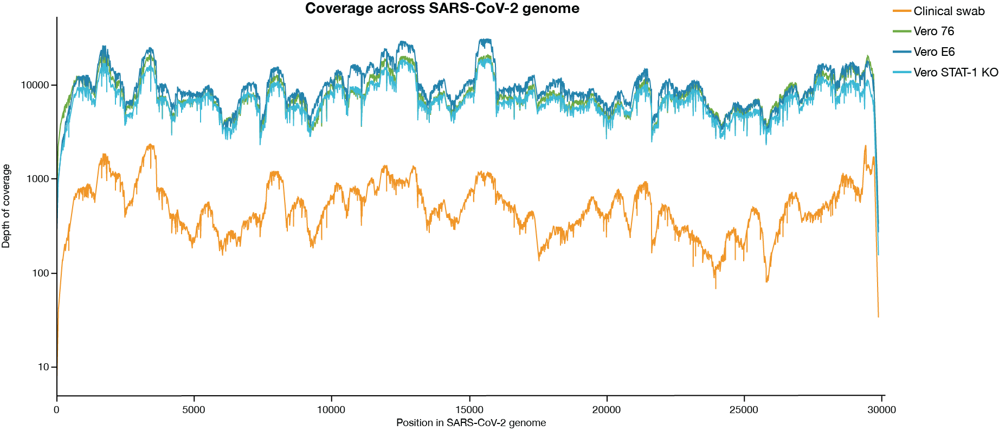
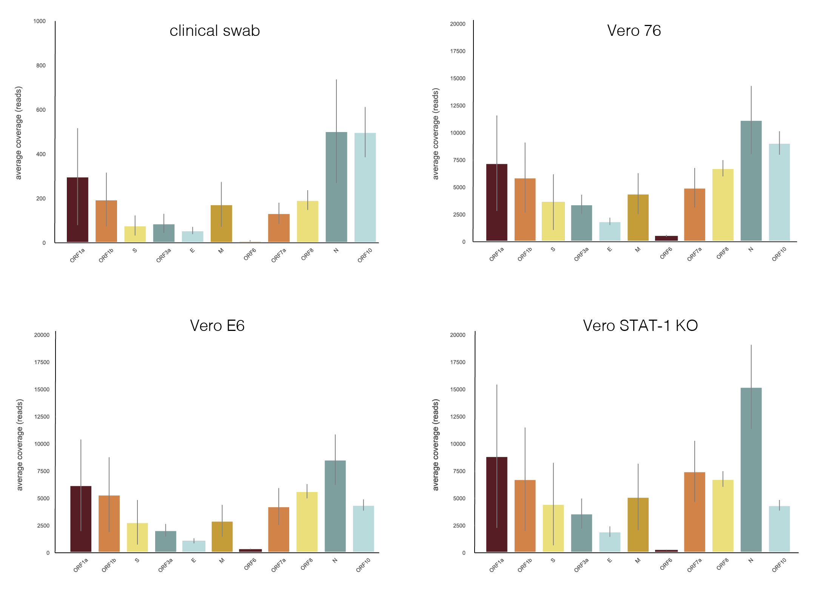
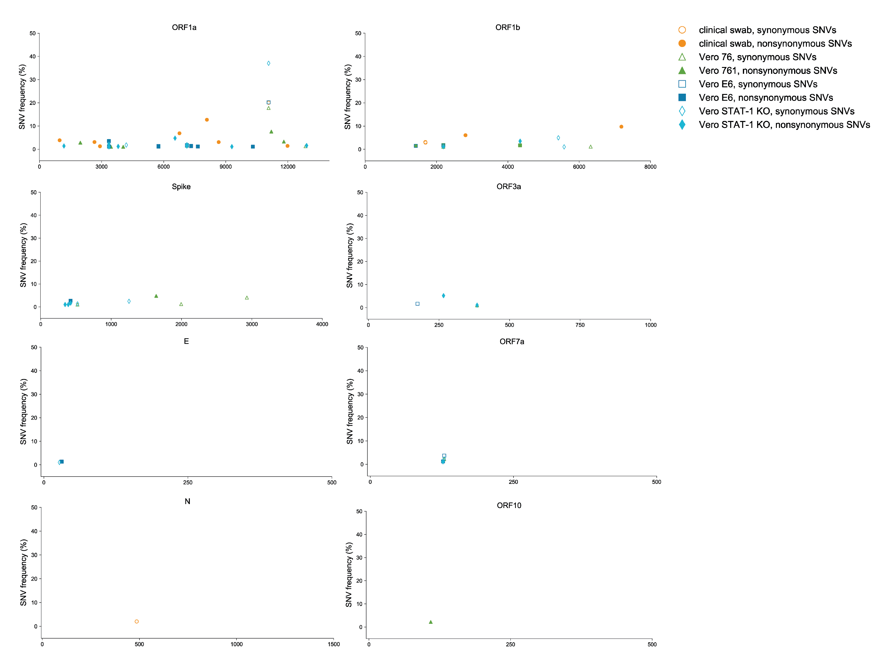

### Authors

**Katarina Braun** (graduate student in Thomas Friedrich's lab)  Twitter: [@KATarinambraun](https://twitter.com/KATarinambraun) GitHub: [katarinabraun](https://github.com/katarinabraun)

**Gage Moreno** (graduate student in Dave O'Connor's lab) Twitter: [@GageKMoreno](https://twitter.com/GageKMoreno)

---------------------
## Data availability 

We have made our cleaned FASTQ* files available at the following SRA: [SRP250294](https://trace.ncbi.nlm.nih.gov/Traces/sra/?study=SRP250294)

**Note these FASTQs have been depleted of host sequences and other contaminating sequences.

We are additionally making our data available at [LabKey](https://openresearch.labkey.com/wiki/ZEST/Ncov/page.view?name=SARS-CoV-2%20Deep%20Sequencing). 

---------------------
## Scripts used
### ONT scripts 
The entire [ONT workflow](https://openresearch.labkey.com/wiki/ZEST/Ncov/download.view?entityId=4eb3b231-36df-1038-8f6c-473ee5860183&name=ONT_Workflow.zip) is uploaded as a series of snakemake and bash scripts that can be run one by one or can by run sequentially using the `workflow.sh` script as a driver script.
A brief description of the ONT workflow contents:
- `01.partition.sh` - will combine all ONT fastq_pass files into one merged folder and then will partition it out into 36 sub-folders to demultiplex simultaenously. 
- `02.demultiplex.snakefile` - Runs `qcat` on the 36 sub-folders. Discards reads <300bp in length. Trims out ONT adaptors and barcodes. 
- `03.merge-demultiplex.sh` - Merges the demultiplexed reads into a single fastq.gz for each barcode using `pigz`.
- `04.subsample_QC.snakefile` - Discards reads ≤Q7 and trims out SISPA primer sequence using `reformat.sh`.
- `05.remove-host-reagent.snakefile` - Uses `minimap` to bioinformatically deplete of host and reagent contaminants.
- `06.map-reference-genome.snakefile` - Maps cleaned reads to a reference file using `minimap` and will call variants ≥10% frequency using `callvariants.sh`. 
- `06.bam_to_fastq.snakefile` - Converts the mapped bam file to fastq using `reformat.sh`.
- `07.map-by-gene.snakefile` - Maps cleaned reads to a reference file composed of only the coded gene regions using `minimap`. 
- `08.call-variants-by-gene.snakefile`- Call variants in the coded gene regions using `callvariants.sh`. 
- `09.minhash.dataset.snakefile` - Performs `sendsketch.sh` on the entire dataset - outputs the top 1000 hits in your sample. 
- `09.minhash.sequences.snakefile` - Performs `sendsketch.sh` and classifies reads on a per sequence basis 

### Illumina scripts

All scripts used for data analysis and figure generation are available in the zipped directory `Illumina_scripts` attached below.  
A brief description of the Illumina workflow contents: 
- `Sniffles.py` was used to process raw data. Sniffles is a pipeline originally written for the analysis of influenza genomes, but has been minimally adapted for analysis of SARS-CoV-2 here. It is a configurable pipeline that performs multiple functions to generate variant and consensus level information. It requires minimal dependencies as the pipeline relies on a docker container to host the software. All parameters for this script are defined in the `config.yml` file. 
- All figures were generated using matplolib packages in Jupyter Notebook scripts. All derived data and scripts are available within the `Illumina_scripts` zipped directory as well. Specific instructions for running each analysis is outlined as the top of each Jupyter Notebook file. 
	- Coverage per gene was generated using `coverage/coverage.ipynb`
	- Genewise nucleotide diversity was generated using `diversity/diversity.ipynb`
	- The SNP frequency spectrum was generated using `SNP_frequency_spectrum/SNP_frequency_spectrum.ipynb`
	- Individual SNVs were plotted using the `SNVs/SNVs.ipynb` script

---------------------
## Introduction 
Recent studies of SARS-CoV-2 have sequenced clinical samples or primary passaged samples in real time but have yet to look at low level viral diversity. It is critical to evaluate viral diversity below the consensus level as minor variants may impact patterns of virulence and person-to-person transmission efficiency. Additionally, the relative frequencies and functional impact (at the amino acid level) of this variation can be leveraged to make inferences about viral population dynamics and the relative roles of selection and random genetic fluctuations, or genetic drift. 

To characterize within-host viral diversity of this emerging virus, we obtained four SARS-CoV-2 samples from Yoshihiro Kawaoka’s lab: 
1. A clinical swab obtained from a confirmed case in Madison, WI. 
2. Cell culture isolates - all having undergone one passage each:   
    - Vero 76; ATCC CRL-1587
    - Vero E6, C1008; ATCC CRL-1586
    - Vero STAT-1 KO; ATCC CCL-81-VHG 

**We will continue to update this repository as we sequence additional samples.**

We used [Sequence-Independent, Single-Primer Amplification (SISPA)](https://www.protocols.io/view/sequence-independent-single-primer-amplification-o-bckxiuxn) to capture and enrich viral nucleic acid. We then prepared libraries for Oxford Nanopore Sequencing on a GridION using the 1D ligation sequencing kit (SQK-LSK109) with its native barcodes and sequenced on an R9.4 flow cell. In parallel we prepared Nextera XT libraries for sequencing on an Illumina MiSeq platform. 

Millions of ONT reads were available within 12 hours of initiating sequencing. Reads were demultiplexed using `qcat` and bioinformatically depleted of host and reagent contaminants. Reads <300bps in length were discarded as well as reads with a quality score ≤Q7. Cleaned viral reads were then mapped to the severe acute respiratory syndrome coronavirus 2 isolate 2019-nCoV/USA-WI1/2020 reference using `mimimap2` (Genbank: MT039887.1, originally sequenced by the CDC).  The resulting mapped reads were viewed with Geneious Prime 2020. 

Illumina reads were available within 48 hours of initiating sequencing. Similiar to the ONT data, reads were paired, merged and trimmed for quality. Reads <100bps in length were discarded. Reads were mapped to the Madison case consensus sequence as above using `bowtie2`. Variants were called using `Varscan` with a minimum depth of 100 reads, a minimum quality score of Q30, and a minimum frequency of 1%. Variants were annotated using a custom annotator. Diversity metrics were generated using `SNPGenie`. All figures were generated using custom python scripts.

---------------------

### SISPA's ability to capture and amplify SARS-CoV-2 
SISPA uses a random nonamer with a tagged sequence that is incorporated into first strand cDNA synthesis during reverse transcription. This tagged section allows for targeted amplification of reads that contain the integrated SISPA primer. This metagenomics sequencing approach enabled unbiased full genome amplification of all RNA in a sample. Below is a table that outlines the total number of reads generated by SISPA and how many of those reads mapped back to the SARS-CoV-2 reference from the Madison, WI patient (Genbank: MT039887.1).

| Sample |total reads || reads after cleaning| | reads mapping to SARS-CoV-2 || % of total reads mapped ||
|----|---|---|----|----|----|---|---|----|
||ONT|Illumina|ONT|Illumina|ONT|Illumina|ONT|Illumina|
clinical swab | 1,141,447 |1,230,304|53,336 |387,302|37,999 |15,216| 3.33% |3.93% |
Vero NCB P1 | 490,335 |1,131,053| 483,484 |431,299| 482,955 |372,968| 98.49% | 86.48% |
Vero E6 P1 | 583,544 |1,137,981| 567,523 |363,723| 566,848 |324,569| 97.14% |89.24% |
Vero STAT-1 KO P1 | 404,024 |1,204,877| 396,732 |506,720| 396,369 |460,776| 98.11% |90.93% |

---------------------

## Coverage maps

### ONT data 

### Illumina data

---------------------

## Other **hits** in the samples 
Using a metagenomics approach, we were also able to determine what other contaminants were in our samples. Using bbmap’s `sendksetch` tool, we were able to generate hash values for each read and compare those to the hash values previously generated of the Genbank nt database. We then output the top 1000 hits into a text file. These files are uploaded below. 

For the clinical swab we detected a variety of bacteria known to be normal skin flora, like Cutibacterium sp., Staphylococcus sp., and Streptococcus sp.. 

In the clinical swab and all of the passaged samples, we found evidence of Mycoplasma sp.- however, it's likely these reads came from the swab as there were more Mycoplasma hits in the swab than the passaged samples. To explore these reads further, we mapped all of the ONT reads to a mycoplasma reference (Genbank: NC_0053642) and found that the reads mapped predominantly to rRNA genes. We then looked at these sequences in BLAST and found that they predominantly matched Cutibacterium sp.. To confirm, we took the Illumina reads that did not match to the SARS-CoV-2 reference and mapped these to the Mycoplasma reference. None of the Illumina reads mapped to the Myocplasma reference. For these reasons, we are confident that these samples were free of Mycoplasma sp.. The high error rate of ONT sequencing and decreased sensitivity of `sendsketch` in comparison to BLAST led to these false positives. However, it is likely that these reads came from some resulting bacterial tRNA in the sample (likely from the nasal microbiome.)    

---------------------

## Consensus sequences match previously sequenced clinical isolate
After 12 hours of sequencing by ONT, the consensus sequences of the swabbed sample mapped perfectly to the reference sequence from the CDC (Genbank: MT039887.1) showing that ONT sequencing is a viable option for quickly obtaining consensus sequence data from future patients. Additionally, three passaged isolates mapped perfectly to the reference sequence from the CDC (Genbank: MT039887.1). This indicates that no major genetic variants became fixed during passage. This was validated by Illumina sequencing.

 

---------------------

## Minor variants found in SARS-CoV-2 samples

To analyze variants present in these samples, we used a conservative frequency cutoff for the ONT data of 10% and a 1% cutoff for the Illumina data. Variants were called using bbmap's `callvariants.sh` tool for the ONT data and `Varscan` for the Illumina data. 

---------------------

**ONT VARIANTS >10%**

|Gene|Position in Gene|Reference nt|Variant nt|annotation||||Vero 76||Vero E6||Vero STAT-1 KO||
|------------------|------------------|--------------|------------|-|--|-------|-|-------------|-|------------|-|-------------------|-|
|||||||ONT|Ilumina|ONT|Illumina|ONT|Ilumina|ONT|Illumina|
|SARS_CoV_2_ORF1a|6548|C|T|T2183I||||||||10.78|4.76|
|SARS_CoV_2_ORF1a|11070|G|T|synonymous||16.86|20.0|13.21|17.78|15.53|20.21|27.91|37.05|
|SARS_CoV_2_ORF1a|8089|C|G|R2697G|||12.71|||||||

---------------------

**ONT VARIANTS <10%**

After obtaining Illumina sequencing data, we were able to validate ONT’s ability to capture minor variants that occurred at a frequency of less than 10%. Briefly, we called variants at percentage frequencies decreasing by 0.5% (eg. Calling 8% variants, then followed by 7.5%) until the variants called by ONT no longer matched that of Illumina called variants. We found that for the swab we were able to call minor variants that occurred at ≥8% frequency. For the passaged samples, ONT was able to capture variants that occurred at ≥4.5% frequency. This is likely due to the passaged samples having a higher titer of virus and greater sequencing depth; allowing us to discern between sequencing errors and true minor variants.

|Gene|Position in Gene|Reference nt|Variant nt|annotation||||Vero 76||Vero E6||Vero STAT-1 KO||
|------------------|------------------|--------------|------------|-|--|-------|-|-------------|-|------------|-|-------------------|-|
|||||||ONT|Ilumina|ONT|Illumina|ONT|Ilumina|ONT|Illumina|
|SARS_CoV_2_ORF1a|4191|C|T|synonymous||||||||5.1|1.81|
|SARS_CoV_2_ORF1a|11202|G|T|W3734C||||5.95|7.59|||||
|SARS_CoV_2_ORF1b|5415|A|G|synonymous||||||||5.97|4.95|
|SARS_CoV_2_S|1640|C|T|T547I||||5.64|4.8|||||
|SARS_CoV_2_ORF3a|266|C|T|T89I||||||||8.36|5.19|

---------------------

**Number of Illumina Variants >1%**

|genes|clinical swab||Vero 76||Vero E6||Vero STAT-1 KO||# SNVs/gene|
|-|-|-|-|-|-|-|-|-|-|
||synonymous variants|nonsynonymous variants|synonymous variants|nonsynonymous variants|synonymous variants|nonsynonymous variants|synonymous variants|nonsynonymous variants|
|ORF1a|1|8|3|9|2|9|2|9|43|
|ORF1b|2|3|2|3||2|2|2|16|
|S|||3|1||1|2|3|10|
|ORF3a||||1|1|||2|4|
|E||||||1|1||2|
|M|||||||||0|
|ORF6|||||||||0|
|ORF7a|||1|1|1|1|1|1|6|
|ORF8|||||||||0|
|N|1||||||||1|
|ORF10||||1|||||1|

---------------------

**Illumina SNP Frequency Spectrum**

 

An excess of low-frequency variants can occur due to purifying selection acting to remove new variants before they can reach mid- or high-frequencies. Exponential population expansion can also cause an excess of low-frequency variation. This is likely the signal we are picking up here. 

(*For the neutral expectation, Trevor Bedford suggested this will follow a 1/x distribution so we integrated over a 1/x distribution between each bin size (0.01 to 0.1, 0.1 to 0.2, etc) and calculated the proportion of SNVs that are expected to fall into each frequency bin. More details on this can be found in the figure generation script*)

---------------------

**Illumina Diversity Metrics** 

 

We determined genewise diversity using and compared nonsynonymous (πN) and synonymous (πS) polymorphisms. In general, as most random nonsynonymous mutations are likely to be disadvantageous, we expect πN = πS indicates neutrality suggesting that allele frequencies are determined primarily by genetic drift. πN < πS  indicates purifying selection is acting to remove new deleterious mutations, and πN > πS  indicates diversifying selection is favoring new mutations and my indicate positive selection is acting to preserve multiple amino acid changes. 

Overall, diversity is incredibly low. πN and πS are only really meaningfully measurable in ORF1a (which takes up about ~30% of the entire genome). The difference between πS and πN in ORF1a is minute suggesting the primary signature of population diversity is likely genetic drift or population size change. 

**Illumina SNPs per gene** 

*only genes where SNPs were identified are displayed*

 

---------------------

## Conclusions
Here we show that through one passage, SARS-CoV-2 consensus genome does not incur any major genome variation. This will be important for those planning to propagate virus to generate stocks. Additionally, it is important for those planning to challenge animals to understand the minor genetic variants that are in virus stocks as those could become fixed over time and alter outcomes. Overall, we find very limited diversity within these viral populations. There is an excess of low-frequency variants compared to what would be expected in a "neutral" (no selection, no population size changes) viral population, which is likely a signature of recent population growth. It is also interesting to note there are actually more nonsynonymous minor variants than synonymous variants -- this could be indicative of recent diversifying selection. However, there are so few SNPs overall it is difficult to make any sweeping conclusions. 

Importantly, we also showed concordant variant calls between ONT and Illumina data down to frequencies above 4.5%.

